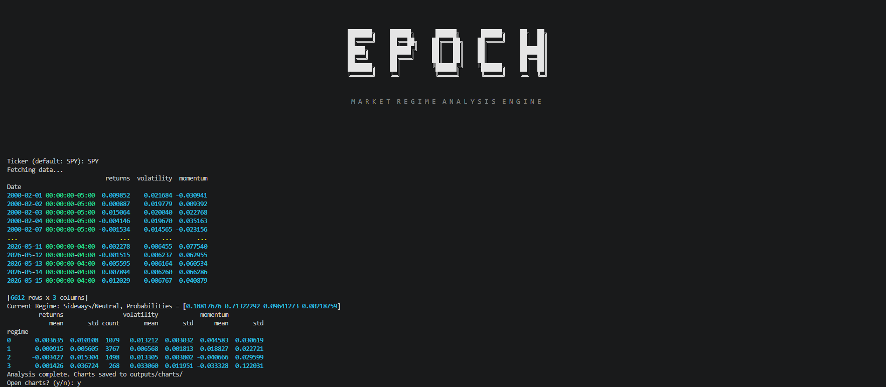
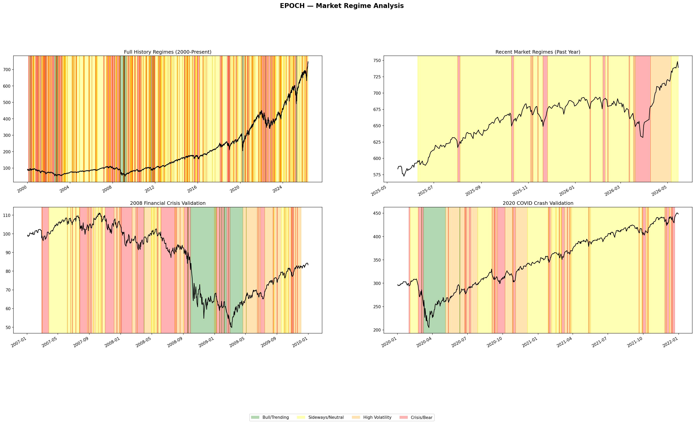

# Epoch — Market Regime Analysis Engine

A terminal-based machine learning system that classifies current 
market conditions into distinct volatility regimes using an original 
trained Gaussian Mixture Model on historical price data.

---

## Status
✅ Core ML pipeline complete | 🚧 Terminal interface in progress

---

## What It Does

Epoch analyzes historical market data and classifies what regime 
the market is currently in Bull/Trending, Sideways/Neutral, 
High Volatility, or Crisis/Bear without any labeled training data.

---

## Tech Stack

- Python
- scikit-learn — GMM implementation
- pandas / numpy — feature engineering
- yfinance — market data pipeline
- matplotlib — validation chart generation
- rich — terminal interface

---

## Project Structure

```
epoch/
├── data/
│   └── fetcher.py          
├── features/
│   └── engineer.py         
├── models/
│   └── regime.py                       
├── validation/
│   └── validator.py        
├── outputs/
│   └── charts/                           
├── config.py               
├── main.py                 
└── requirements.txt
```

---

## How to Run

```bash
git clone https://github.com/chase-meyers/epoch
cd epoch
pip install -r requirements.txt
python main.py
```

---

## Output



---

## Validation

The model was validated against known historical market events to confirm regime classifications are meaningful. The chart below shows four views of the regime detection output using SPY (S&P 500 ETF) as the reference ticker.


**Full History (2000-Present):** Shows the complete regime classification history across 26 years of market data. The model identifies distinct periods of market behavior without any labeled training data.

**Recent Market Regimes (Past Year):** Shows the most recent 252 trading days of regime classifications, reflecting current market conditions. The model correctly identified elevated volatility and crisis conditions during the market turbulence of early 2026.

**2008 Financial Crisis Validation:** The model correctly detected sustained Crisis/Bear conditions throughout the 2008-2009 financial crisis, with the deepest crash period showing the highest concentration of crisis classifications.

**2020 COVID Crash Validation:** The model detected the rapid transition from normal market conditions into Crisis/Bear in March 2020, followed by recovery through the remainder of 2020 and into 2021.




---

## Technical Decisions


**Why Gaussian Mixture Model:**
GMM was chosen over simpler clustering approaches like K-means because market regimes are not hard boundaries. A period can be transitioning between states, and GMM captures that uncertainty by assigning probabilistic membership to each regime rather than forcing a hard classification. This makes regime transitions more honest and interpretable.


**Why unsupervised learning:**
No labeled dataset exists identifying which historical periods were bull markets or crises. The model learns market states entirely from the structure of the data itself, making the classifications data-driven rather than human-defined.


**Why three engineered features:**
Daily returns capture short term price movement. Rolling volatility measures how turbulent the market has been over the past 20 trading days. Momentum captures the direction and strength of the trend over the same window. Together these three signals give the model a complete picture of current market conditions without overfitting to noise.


**Why 20-day rolling windows:**
A 20-day window roughly corresponds to one trading month, balancing responsiveness to new market conditions against stability. Shorter windows produce noisy regime flickering. Longer windows lag too far behind actual market shifts to be actionable.


**Why n_init=50:**
GMM training is sensitive to random initialization and can converge to suboptimal local solutions. Running 50 initializations and selecting the best result significantly reduces this risk and produces more consistent and meaningful regime classifications across different runs.


**Why terminal interface:**
Professional financial tools prioritize data density and speed over visual complexity. The terminal interface delivers regime classifications instantly without the overhead of a web UI, reflecting the same philosophy as industry standard tools like Bloomberg Terminal.

---

## Author

Chase Meyers | CS @ University of Tennessee, Knoxville
